🌐 **Language / Idioma:** [English](README.md) • [Español](README.es.md)

<p align="center">
  
</p>

<h3 align="center">🐾 Retro Bomberman-Inspired Arcade Game Engineered in Java</h3>

<p align="center">
  A feature-rich desktop game designed and implemented under strict <b>Software Engineering</b> principles, featuring <b>Model-View-Controller (MVC)</b> architecture, <b>GoF Design Patterns</b>, and original pixel-art assets.
</p>

<p align="center">
  
  
  
  
  
</p>

---

## 📌 Table of Contents
1. [Overview & Highlights](#-overview--highlights)
2. [Visual Showcase & Gameplay](#-visual-showcase--gameplay)
3. [Controls & Mechanics](#-controls--mechanics)
4. [Software Architecture & Design Patterns](#-software-architecture--design-patterns)
5. [Project Structure](#-project-structure)
6. [Quick Start & Execution](#-quick-start--execution)
7. [Engineering Team & Roles](#-engineering-team--roles)
8. [Academic Context & License](#-academic-context--license)

---

## 🌟 Overview & Highlights

**KittyBoom** reimagines the classic arcade Bomberman formula with a feline twist. Developed collaboratively by computer engineering students, the project prioritizes **code quality, modularity, high cohesion, and low coupling** over ad-hoc game scripts.

* **Clean Object-Oriented Design:** Zero monolithic god-classes. Entity behaviors are delegated to specialized strategy and state components.
* **Reactive UI Synchronization:** Uses the **Observer Pattern** to decouple high-frequency game loop updates from Swing graphical components.
* **Extensible Entity System:** Blocks, bombs, and characters are dynamically provisioned through **Factory** abstractions.
* **Custom Pixel Art & Animations:** 100% original sprite work, animated GIFs for character states, stage backgrounds, and multi-phase Boss encounters.
* **Zero External Dependencies:** Built with pure Java Standard Library (SE 17/21) and Swing, allowing cross-platform portability without bulky runtime engines.

---

## 🎮 Visual Showcase & Gameplay

### Character Selection & Menu
<p align="center">
  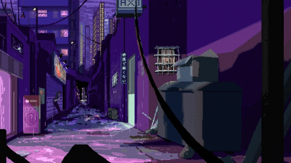
  &nbsp;&nbsp;&nbsp;&nbsp;
  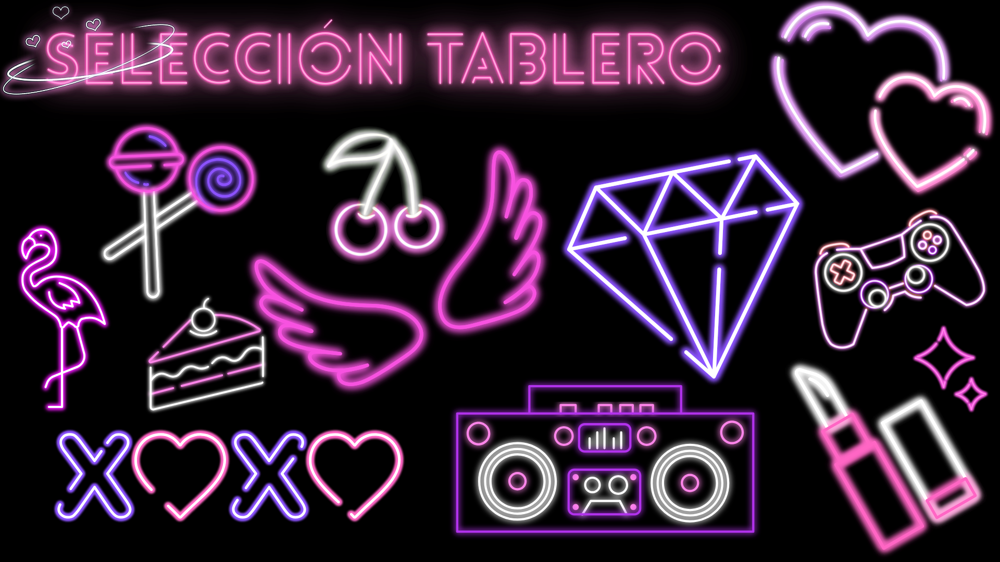
</p>

| White Cat Bomber (`BomberManBlanco`) | Black Cat Bomber (`BomberManNegro`) |
| :---: | :---: |
|  | 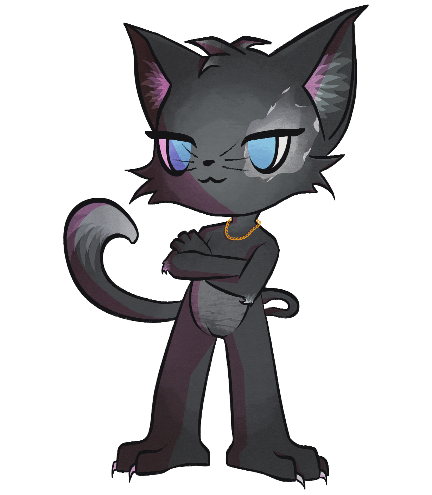 |
| Agile playstyle & signature sprite set | Tactical bomber & custom explosion effects |

### Multi-Stage Battles & Epic Boss Encounters
The game features procedural block layouts and dedicated Boss stages with dynamic state-driven animations:

<p align="center">
  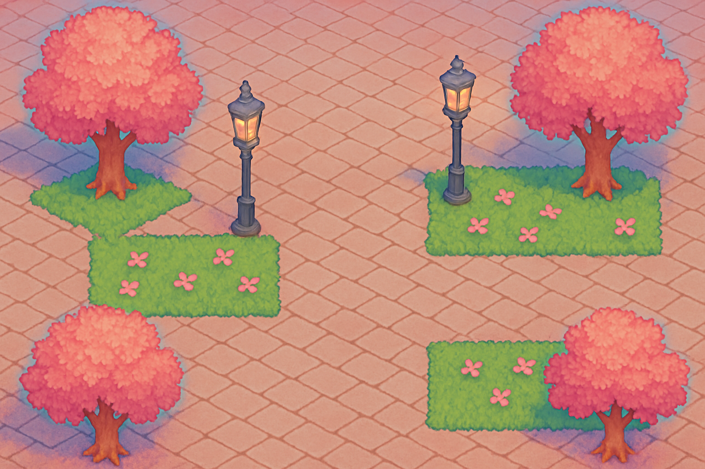
  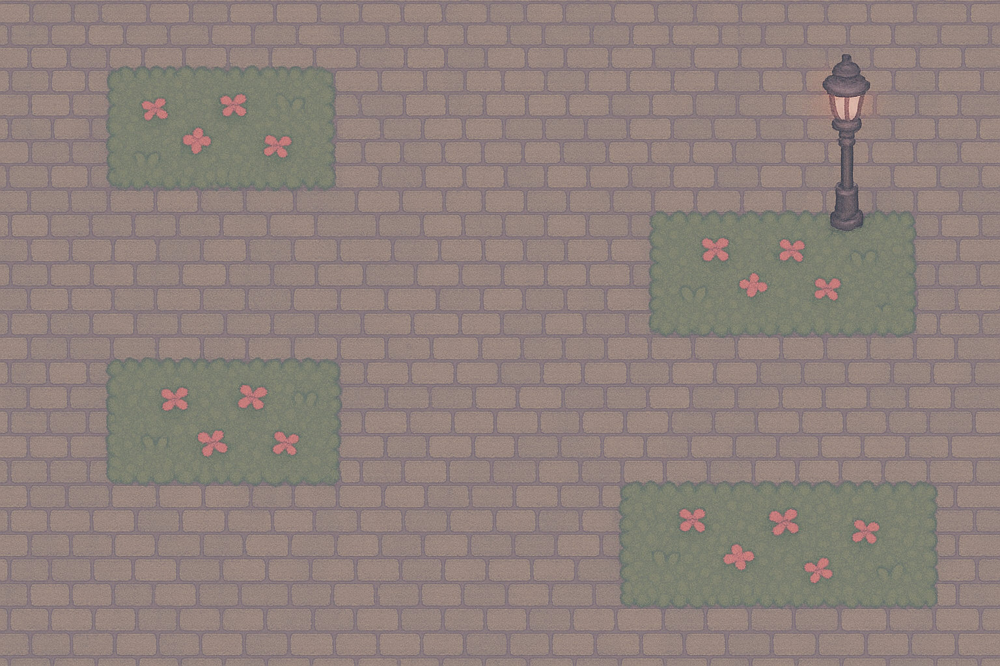
  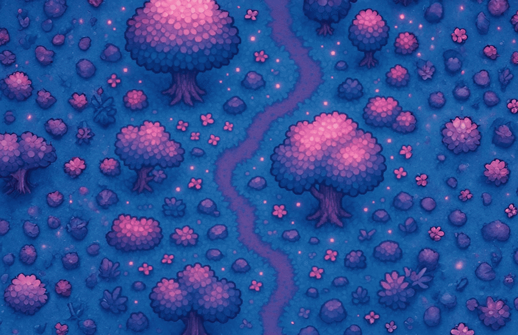
</p>

<p align="center">
  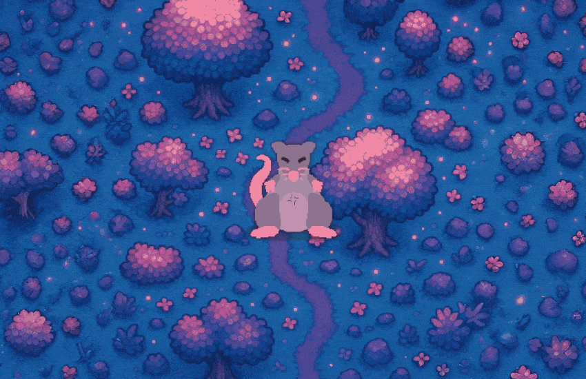
  
  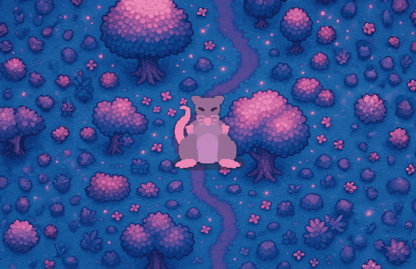
  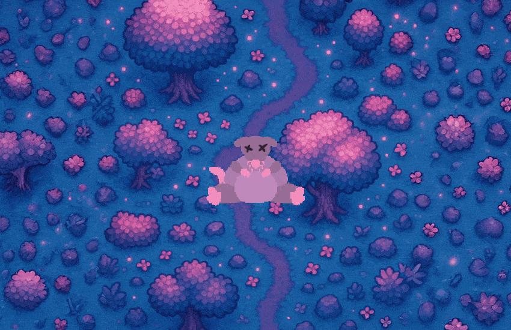
</p>

---

## 🕹️ Controls & Mechanics

| Context | Action | Key Binding |
| :--- | :--- | :--- |
| **Menu Screen** | Switch Character | <kbd>←</kbd> / <kbd>→</kbd> (Left / Right Arrow) |
| **Menu Screen** | Open Stage Options | <kbd>O</kbd> |
| **Menu Screen** | Start Selected Stage | <kbd>Enter</kbd> or <kbd>Space</kbd> |
| **In-Game** | Move Bomber Up | <kbd>W</kbd> or <kbd>↑</kbd> |
| **In-Game** | Move Bomber Down | <kbd>S</kbd> or <kbd>↓</kbd> |
| **In-Game** | Move Bomber Left | <kbd>A</kbd> or <kbd>←</kbd> |
| **In-Game** | Move Bomber Right | <kbd>D</kbd> or <kbd>→</kbd> |
| **In-Game** | Plant Bomb | <kbd>Space</kbd> |

---

## 🏗️ Software Architecture & Design Patterns

The codebase is strictly structured following the **Model-View-Controller (MVC)** architectural paradigm:

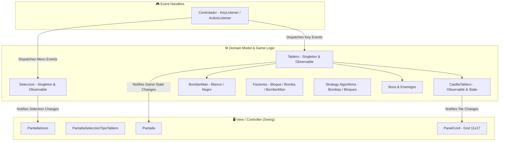

### Applied GoF Design Patterns

#### 1. Factory Pattern & Singleton Pattern
Creation of game entities is decoupled via dedicated factories to avoid tight coupling between components:
* `BloqueFactory`: Instantiates destructible, indestructible, empty, and boss barrier tiles (`Blando`, `Duro`, `Barrera`, `BloqueBoss`, `Vacio`).
* `BombaFactory`: Generates and arms special bombs (`BSuper`, `BUltra`).
* `BomberManFactory`: Instantiates character archetypes (`BomberManBlanco`, `BomberManNegro`).
* **Singleton** is enforced on `Tablero`, `Seleccion`, and all factories to ensure a centralized, single point of truth across the game lifecycle.

#### 2. Strategy Pattern
Algorithms for destructive radii and board initialization are encapsulated behind polymorphic interfaces:
* `StrategyBombas` (`StBSuper`, `StBUltra`): Implements interchangeable explosion blast patterns and block-clearing mechanics.
* `StrategyBloquesBlando` (`StBloquesBlandoClassic`, `StBloquesBlandoSoft`): Configures destructible block densities per map type.
* `StrategyBloquesDuro` (`StBloquesDuroClassic`, `StBloquesDuroBoss`): Governs indestructible layout geometries and Boss arenas.

#### 3. Observer Pattern
To eliminate tight coupling between business logic and UI rendering:
* `Tablero` (Observable) notifies `Pantalla` (Observer) when the remaining enemy count changes or special boss cinematics trigger.
* `CasillaTablero` (Observable) notifies individual `PanelCord` cells (Observer) to trigger targeted sprite repaint cycles without redrawing the entire screen.
* `Seleccion` (Observable) notifies `PantallaInicio` (Observer) whenever characters or options are toggled.

#### 4. State Pattern
* Managed through `CasillaTablero.cambiarCasilla(Casilla)`, allowing tiles to transition smoothly between empty space, active bomb countdowns, active fire explosions, bonus drops, and character collisions.

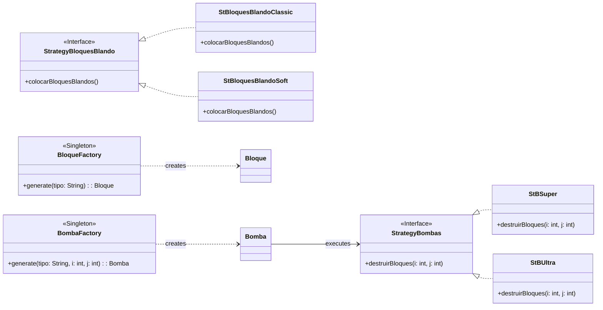

---

## 📁 Project Structure

```text
KittyBoom/
├── src/                                     # Source Code & Assets
│   ├── main/
│   │   └── main.java                        # Application Bootstrap
│   ├── model/                               # Business & Game Logic (Domain)
│   │   ├── Bloques/                         # Tiles, Barriers, Strategy & Factory
│   │   ├── Bombas/                          # Bomb logic & explosion radius strategies
│   │   ├── BomberMans/                      # Player entities & customization factory
│   │   ├── Casillas/                        # Tile state management & explosion triggers
│   │   ├── Mobs/                            # Enemy AI & Boss finite state machine
│   │   └── Tableros/                        # Board matrix, stage controllers & selection
│   └── viewController/                      # Presentation Layer (Swing GUI)
│       ├── Bomberman/                       # Character sprite animation sheets
│       ├── Imagenes/                        # Background stages, titles & animated GIFs
│       ├── Objetos/                         # Bomb, balloon & obstacle sprite assets
│       └── Pantallas/                       # Swing Frames, Panels & Event Controllers
├── run.bat                                  # Windows 1-click launcher
├── run.sh                                   # Linux / macOS launcher
├── build_jar.bat                            # Standalone executable JAR generator
├── LICENSE                                  # MIT Open Source License
└── README.md                                # Project Documentation
```

---

## 🚀 Quick Start & Execution

### Prerequisites
* **Java Development Kit (JDK) 17 or higher** (Tested with OpenJDK / Oracle JDK 21).

### Option 1: One-Click Launch (Terminal)
Clone the repository and run the startup script for your operating system:

**Windows:**
```cmd
git clone https://github.com/aimarlarriba/KittyBoom.git
cd KittyBoom
run.bat
```

**Linux / macOS:**
```bash
git clone https://github.com/aimarlarriba/KittyBoom.git
cd KittyBoom
chmod +x run.sh
./run.sh
```

### Option 2: Running in Eclipse / IntelliJ IDEA
1. Open your IDE and choose **Import Existing Project** (or **Open Folder**).
2. Select the `KittyBoom` root directory.
3. Verify that `src` is marked as the **Source Root**.
4. Run `main.main` as a **Java Application**.

### Option 3: Build Standalone JAR
To create a portable, standalone executable `.jar` file:
```cmd
build_jar.bat
java -jar KittyBoom.jar
```

---

## 👥 Engineering Team & Roles

* **[Aimar Larriba](https://github.com/aimarlarriba)** — Software Architecture, Core Game Logic & Repository Lead.
* **Lou Gómez** — Software Development, Game Loop & Object-Oriented Modeling.
* **Iván Herrera** — Software Development & Complete Visual Design / Pixel-Art Assets.
* **Daniel Talmaci** — Software Architecture, Pattern Implementation & Event Controls.
* **David Miguez** — Software Architecture, Board State & Game Mechanics.

---

## 🎓 Academic Context & License

This project was engineered as part of the **Software Engineering** course within the **Degree in Management and Information Systems Computer Engineering** at the **University of the Basque Country (UPV/EHU)**.

Distributed under the **[MIT License](LICENSE)**. Feel free to explore, learn, and adapt the code for educational purposes.
